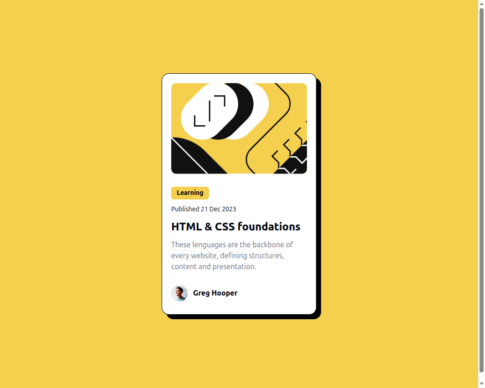

# Frontend Mentor - Blog preview card solution

This is a solution to the [Blog preview card challenge on Frontend Mentor](https://www.frontendmentor.io/challenges/blog-preview-card-ckPaj01IcS). Frontend Mentor challenges help you improve your coding skills by building realistic projects. 

## Table of contents

- [Overview](#overview)
  - [The challenge](#the-challenge)
  - [Screenshot](#screenshot)
  - [Links](#links)
- [My process](#my-process)
  - [Built with](#built-with)
  - [What I learned](#what-i-learned)
  - [Useful resources](#useful-resources)
- [Author](#author)

## Overview
A learning card of a HTML and CSS course.

Use HTML to structure the page and Tailwindcc for styles

use to change the styles
```bash
node --run build:styles
```

### The challenge

Users should be able to:

- See hover and focus states for all interactive elements on the page

### Screenshot



### Links

- Solution URL: [Add solution URL here](https://your-solution-url.com)
- Live Site URL: [Add live site URL here](https://your-live-site-url.com)

## My process
I just take a Tailwindcss course so I wanted to practice it.
1. Structure with HTML
2. Review Tailwind docs to start the project
3. Use the DNS developer tool to do it
4. Insert all the necesary classes
5. Change to Tailwind CLI for deployment
  a. Crate JSON package 

  ```bash
  pnpm init
  ```
  b. Code to import tailwind to css file

  ```bash
  pnpm add tailwindcss @tailwindcss/cli
  ```

  c. Apply changes to page

  ```bash
  pnpx @tailwindcss/cli -i ./input.css -o output.css --watch
  ```

### Built with

- Semantic HTML5 markup
- Flexbox
- CSS Grid
- Mobile-first workflow
- [Tailwind](https://tailwindcss.com/) - For styles

### What I learned

I learn how to integrate tailwindcss into my project.
On the inport.css file, you import tailwindcss taht is previusly install and then you can define variables and aplly font family

```css
@import "tailwindcss";

@font-face {
    font-family: "Figtree_Bold";
    src: url("/assets/fonts/static/Figtree-ExtraBold.ttf");
    font-style: normal;
    font-weight: 800;
    font-display: swap;
}

@font-face {
    font-family: "Figtree_Medium";
    src: url("/assets/fonts/static/Figtree-Medium.ttf");
    font-style: normal;
    font-weight: 500;
    font-display: swap;
}

@theme {
    --color-principal: #f4d04eff;
    --font-bold: "Figtree_Bold" system-ui, sans-serif;
    --font-medium: "Figtree_Medium", system-ui, sans-serif;
}

```

### Useful resources

- [Tailwindcss](https://tailwindcss.com/) - The official docs tailwindcss helped me to find exact classes that I needed
- [Tailwindcss Course](https://www.youtube.com/watch?v=R5EXap3vNDA&t=3405s) - This is a amazing Youtube video in Spanish that helped me understand Tailwind and how to do the intallation.

## Author

- Website - [Melissa Martell Cabrera](https://melissa-martell.github.io/melissa-portfolio/)
- Frontend Mentor - [@yourusername](https://www.frontendmentor.io/profile/melissa-martell)

